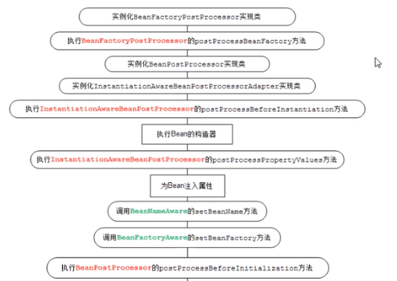

# springDemo
learn to spring 

spring_01_helloworld 体验IOC AOP

1. 准备jar
2. 开发HelloWorld程序
3. 在applicationContext.xml中完成配置 如果获取xsd声明
4. 启动spring容器
5. 从容器中后去指定名称的bean
6. 调用bean方法

什么是BeanFactory?
BeanFactory是Spring最古老的接口，表示Spring IoC容器-- 生产bean对象的工厂，负责配置，
创建和管理bean
被Spring IOC容器管理的对象称为bean

Spring IoC容器如何知道哪些是它管理的对象呢?
需要配置文件，Spring IoC容器通过读取配置文件中的配置元数据，通过元数据对应用中的
各个对象进行实例化及装配。
元数据的配置有三种方式:
1. XML-based configuration
2. Annotation-bared configuration
3. Java-based configuration

Spring IoC管理bean的原理:
1. 通过Resource对象加载配置文件
2. 解析配置文件，得到指定名称的bean
3. 解析bean元素，id作为bean的名字，class用于反射得到bean实例
注意 此时，bean类必须存在一个无参数构造器 和访问权限无关
4. 调用getBean方法的时候，从容器中返回对象实例；
结论:就是把店面从JAVA文件中转移到了XML中

Spring IoC容器(Container)
BeanFactory:Spring最底层的接口，只提供了IoC功能，负责创建、
组装、管理bean，在应用中，一般不使用BeanFactory,而推荐使用
ApplicationContext 应用上下文

ApplicationContext接口继承了BeanFactory，除此之外
还提供AOP集成，国际化处理，事件传播，统一资源加载等功能。


```
public interface ApplicationContext 
           extends EnvironmentCapable, 
           ListableBeanFactory, 
           HierarchicalBeanFactory, 
           MessageSource, 
           ApplicationEventPublisher, 
           ResourcePatternResolver {
   }
```

bean实例化方式
1. 构造器实例化(无参数构造器)，最标准，使用最多
2. 静态工厂方法实例化：解决系统遗留问题
3. 实例工厂方法实例化：解决系统遗留问题
4. 实现FactoryBean接口实例化：实例工厂变种，如集成MyBatis框架使用:
org.mybatis.spring.SqlSessionFactoryBean

bean作用域
在spring容器中是指创建的bean对象相对于其他bean对象的请求可见范围
<bean id="" class="" scope="作用域" />

singleton:单例，在Spring IOC容器中仅存在一个Bean实例(默认的scope)

prototype:多例，每次从容器中调用Bean时，都返回一个新的实例，即每次调用getBean时，
相当于执行new XxxBean(); 不会在容器启动时创建对象

request:用于web开发，将Bean放入request范围，request.setAttribute("xxx"),
在同一个request 获得同一个Bean

session: 用于web开发，将Bean 放入Session范围，在同一个Session获得同一个Bean
globalSession: 一般用于Porlet应用环境，分布式系统存在全局session概念(单点登录)，
如果不是prolet环境，globalSession 等同于Session

application: Scopes a single bean definition to the lifecycle of a ServletContext.
Only valid in  the context of a web-aware Spring ApplicationContext.

websocket: Scopes a single bean definition to the lifecycle of a WebSocket.
Only valid in the context of a web-aware Spring ApplicationContext.

Spring5开始出现:websocket,globalSession作废。

###开发中主要使用: scope="singleton",scope="prototype"
####总结 struts1->action->request
    struts2->action->prototype
    其他使用singletoin
    
bean生命周期: bean从出身--消亡直接的整个过程

BeanFactory:     延迟初始化特点
ApplicationContext: 在启动Spring容器的时候，就会去创建bean对象

<bean id="" class="" init-method="" destroy-method="" />

1.启动Spring容器
2.创建Bean对象 ---> 实例在调用Bean对象的构造器
3.调用Bean对象的初始化init-method

4.我们获取bean对象，调用Bean对象中的某一个方法

5.调用Bean对象的销毁方法destroy-method
6.Spring容器销毁


####实际的生命周期


####Bean的完整生命周期经历了各种方法调用，这些方法可以划分为以下几类:
1.Bean自身方法 : 包括Bean本身调用的方法和通过配置文件中<bean>的init-method和destroy-method指定的方法
2.Bean级生命周期接口方法: BeanNameAware BeanFactoryAware InitializingBean 和 DiposableBean接口的方法
3.容器级生命周期接口方法: InstantiationAwareBeanPostProcessor 和 BeanPostProcessor这两个接口实现，
一般称之为“后处理器”
4.工厂后处理器接口方法: AspectJWeavingEnabler,ConfigurationClassPostProcessor
CustomAutowireConfigurer等等非常有用的工厂后处理器 接口的方法。
工厂后处理器也是容器级的。在应用上下文装配配置文件之后立即调用.

#####什么是注入操作?
setter方法
User u = new User();
u.setName("cuiwjava");
构造器
new User("cuiwjava");
#####注入值类型
1. 常量值(简单类型): value元素
常量类型(固定不变),其实就是一个值，简单类型
2. 对象: ref元素
各自集合对于的元素<set><list><map>
3. 集合: 对应集合类型元素

设置: <bean/> 元素的: autowire属性
<bean id="somebean" class="SomeBean全限定名" autowire="byType" />
autowire属性让Spring按照一定的规则方式自己去找合适的对象，并完成DI操作。
-default不要自动注入，缺省default表示no
-no 不要自动注入
-byName 按照名字注入 属性的名字在Spring中找bean factory.getBean(String beanName)
-byType按照依赖对象的类型注入 factory.getBean(Class requiredType)
-constructor按照对象的构造器上面的参数类型注入
注意:
1.如果按照byName自动注入 要求所有的属性名字和id的名字必须保证一种规范的命名方式;
2.如果按照byType注入，如果Spring中同一个类型有多个实例-->报bean不是唯一类型错误
该类型不推荐 了解即可
